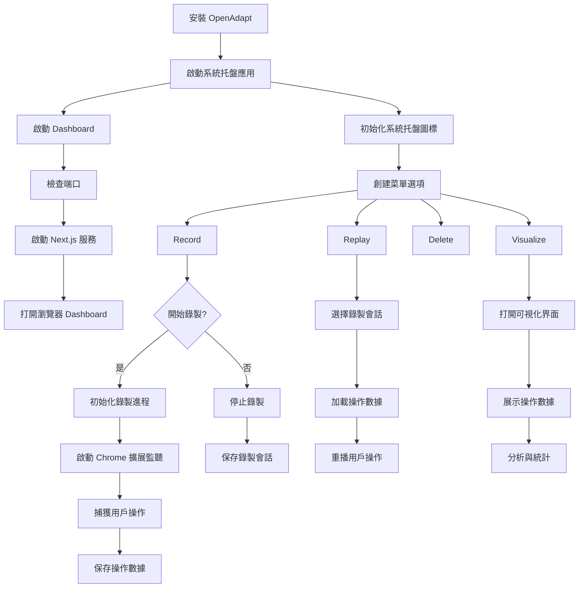

OpenAdapt 的主要流程圖:

這個流程圖展示了以下主要部分:

1. **初始化流程**
   - 安裝程序
   - 系統托盤應用啟動
   - Dashboard 初始化

2. **主要功能流**
   - 錄製功能流程
   - 重播功能流程
   - 可視化功能流程

3. **數據流向**
   - 用戶操作捕獲
   - 數據存儲
   - 數據讀取與展示

4. **交互邏輯**
   - 用戶界面交互
   - 進程間通信
   - 擴展與主程序通信

