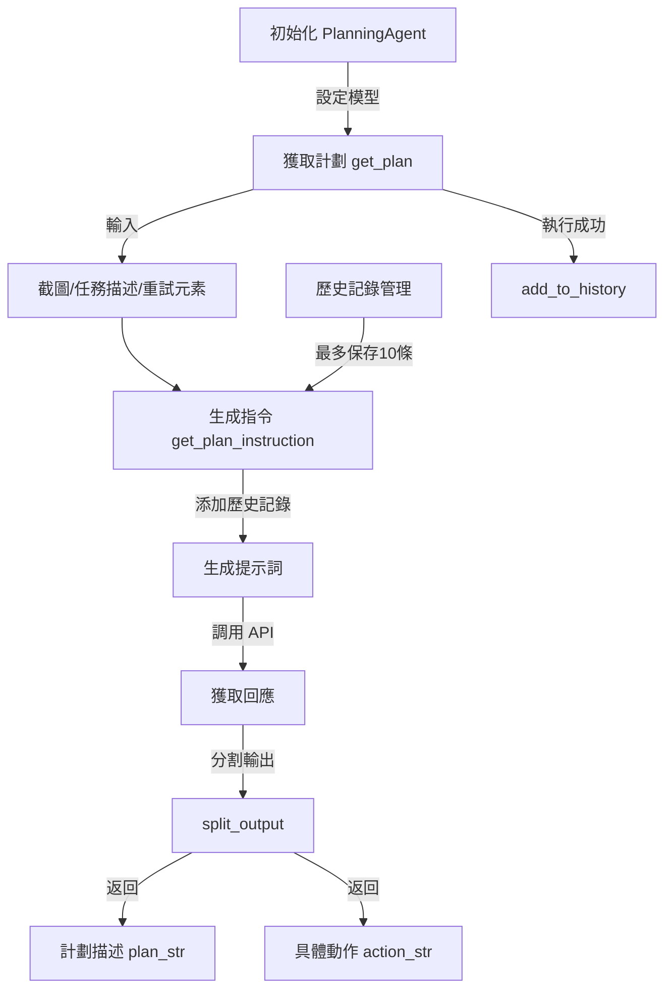

系統架構說明：
1. 主要組件：
PCAgent：主要代理人類別
PlanningAgent：負責規劃的代理人
GroundingAgent：負責基礎工作的代理人
服務連接：
規劃服務器：運行在 localhost:8002
基礎服務器：運行在 localhost:8000
兩個服務器都使用 OpenAI 相容的 API 接口
執行流程：
用戶輸入任務描述
系統創建包含兩個子代理人的 PCAgent
PCAgent 開始執行任務
特殊功能：
支持可選的輸出隊列（output_queue）
使用本地服務器而不是直接連接 OpenAI

PlanningAgent 很可能負責以下工作：
任務分析
接收高層次的任務描述
理解任務的要求和約束條件
計劃生成
將大任務分解成較小的子任務
確定子任務之間的依賴關係
建立執行順序
與 OpenAI API 互動
使用 localhost:8002 的本地服務
可能使用特定的提示模板來引導 AI 生成計劃

planning.py中PlanningAgent 的運作流程。



詳細分析：

1. **初始化階段**
```python
def __init__(self, plan_client):
    self.plan_client = plan_client
    self.plan_model = plan_client.models.list().data[0].id
    self.history = []
    self.HISTORY_CUT_OFF = 10  # 歷史記錄上限
```
- 初始化客戶端連接
- 設置模型 ID
- 初始化歷史記錄列表
- 設定歷史記錄上限為 10 條

2. **計劃生成流程 (get_plan)**
```python
def get_plan(self, screenshot, task_description, retry_click_elements=None):
```
主要參數：
- `screenshot`: 當前畫面截圖
- `task_description`: 任務描述
- `retry_click_elements`: 之前點擊失敗的元素列表

3. **指令生成 (get_plan_instruction)**
- 組合 PLANNING_AGENT_PROMPT 和任務描述
- 添加歷史記錄（最多顯示最近 10 條）
- 生成最終的提示詞

4. **輸出處理 (split_output)**
- 將 API 返回的結果分割為兩部分：
  - `plan_str`: 計劃描述
  - `action_str`: 具體執行動作

5. **歷史記錄管理**
- 使用 `add_to_history` 添加新的執行記錄
- 通過 `HISTORY_CUT_OFF` 控制歷史記錄長度

工作流程：
1. 接收任務描述和截圖
2. 檢查是否有需要重試的元素
3. 生成完整的指令（包含歷史記錄）
4. 調用 AI 模型獲取回應
5. 解析回應為計劃和具體動作
6. 更新歷史記錄

特點：
1. **歷史感知**：通過維護歷史記錄，使 AI 能夠理解之前的操作
2. **錯誤處理**：支持重試機制，可以處理點擊失敗的情況
3. **結構化輸出**：將 AI 回應明確分為計劃描述和具體動作兩部分
4. **圖像理解**：支持處理截圖，可以基於視覺信息做決策

這個設計允許 AI 代理：
- 理解當前環境（通過截圖）
- 記住之前的操作（通過歷史記錄）
- 處理失敗情況（通過重試機制）
- 生成結構化的響應（計劃和動作分離）


grounding.py 中 GroundingAgent 系統的工作流程。

```mermaid
graph TD
    A[開始任務] --> B[PCAgent]
    
    subgraph PCAgent
        B --> C[初始化 Agents]
        C --> D[PlanningAgent]
        C --> E[GroundingAgent]
        
        B --> F[執行任務 run()]
    end
    
    subgraph PlanningAgent流程
        D --> G[獲取計劃 get_plan]
        G --> H[生成指令]
        H --> I[調用AI模型]
        I --> J[返回計劃和動作]
    end
    
    subgraph GroundingAgent流程
        E --> K[尋找元素 find_element]
        K --> L[調用AI定位 call_grounding]
        L --> M[解析座標 parse_coordinates]
        M --> N[驗證結果 check_grounding]
    end
    
    J --> |執行計劃| K
    N --> |回饋結果| G
```

## 系統架構分析

### 1. PCAgent（主控制器）
- **功能**：整體任務的協調和控制
- **職責**：
  - 初始化其他 Agents
  - 協調 Planning 和 Grounding 的互動
  - 執行整體任務流程

### 2. PlanningAgent（規劃代理）
- **功能**：負責任務規劃和決策
- **主要流程**：
  1. 接收任務描述和截圖
  2. 生成執行計劃
  3. 維護操作歷史
  4. 處理失敗重試
- **關鍵方法**：
  - `get_plan()`: 生成執行計劃
  - `add_to_history()`: 記錄執行歷史

### 3. GroundingAgent（定位代理）
- **功能**：負責UI元素定位和驗證
- **主要流程**：
  1. 接收元素描述
  2. 在截圖中定位元素
  3. 驗證定位結果
  4. 返回座標信息
- **關鍵方法**：
  - `find_element()`: 尋找UI元素
  - `call_grounding()`: 調用AI模型定位
  - `check_grounding()`: 驗證定位結果
  - `parse_coordinates()`: 解析座標信息

## 執行流程

1. **任務初始化**
   ```python
   # 創建主代理
   pc_agent = PCAgent(task_description)
   ```

2. **規劃階段**
   ```python
   # 生成執行計劃
   plan, action = planning_agent.get_plan(screenshot, task_description)
   ```

3. **執行階段**
   ```python
   # 定位元素
   x, y, none = grounding_agent.find_element(element_description, screenshot)
   ```

4. **驗證和重試**
   - 如果定位失敗，進行重試
   - 最多重試3次
   - 更新執行歷史

## 特點和優勢

1. **模組化設計**
   - 各個 Agent 職責明確
   - 易於維護和擴展

2. **錯誤處理**
   - 完善的重試機制
   - 驗證結果的可靠性

3. **歷史感知**
   - 維護操作歷史
   - 支持上下文相關的決策

4. **靈活配置**
   - 可配置的 AI 模型
   - 可調整的參數設置

## 使用的技術

1. **AI模型整合**
   - 使用 OpenAI API 或相容接口
   - 支持多種模型配置

2. **圖像處理**
   - 截圖分析
   - 座標轉換

3. **正則表達式**
   - 解析模型輸出
   - 提取座標信息


