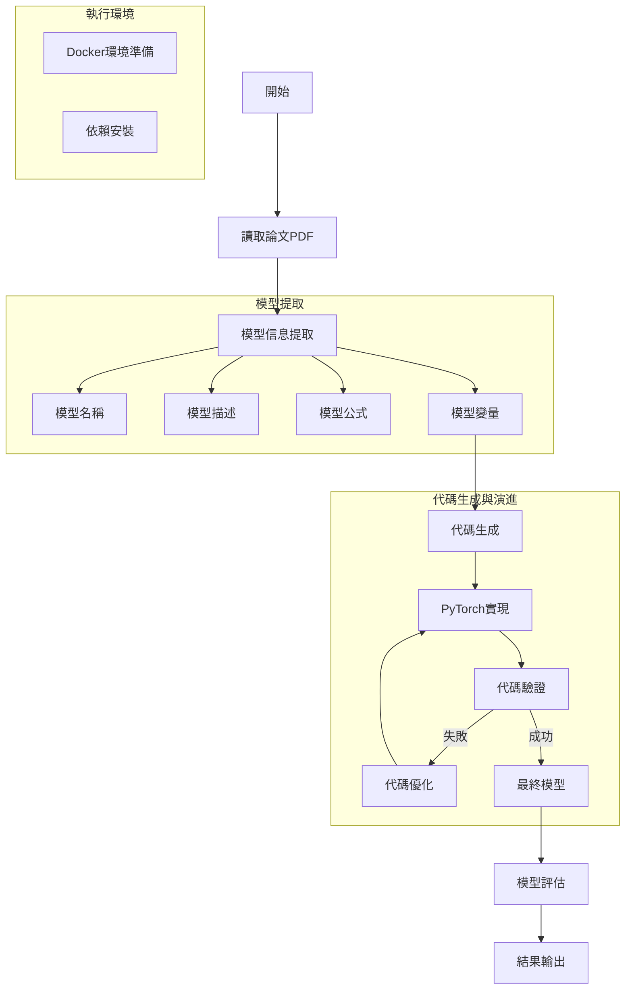

general_model 的流程圖：



主要流程說明：

1. **入口配置**:
```python:rdagent/app/general_model/general_model.py
def extract_models_and_implement(report_file_path: str):
    """
    Extract models from report and implement them.

    Args:
        report_file_path: path to the report file
    """
    # 1. Extract models from report
    models = extract_models(report_file_path)
    
    # 2. Implement models
    for model in models:
        implement_model(model)
```

2. **模型提取階段**:
- 從PDF文件中提取模型信息
- 包括：名稱、描述、公式、變量等
- 使用 LLM 進行信息結構化

3. **代碼生成階段**:
```yaml:rdagent/components/coder/model_coder/one_shot/prompt.yaml
code_implement_user: |-
  With the following given information, write a python code using pytorch and torch_geometric to implement the model.
  This model is in the graph learning field, only have one layer.
  The input will be node_feature [num_nodes, dim_feature] and edge_index [2, num_edges]
  
  1. model name:{{name}}
  2. model description:{{description}}
  3. model formulation:{{formulation}}
  4. model variables:{{variables}}
```

4. **執行環境配置**:
```dockerfile:rdagent/scenarios/data_mining/docker/Dockerfile
FROM pytorch/pytorch:2.2.1-cuda12.1-cudnn8-runtime

RUN apt-get clean && apt-get update && apt-get install -y \  
    curl \  
    vim \  
    git \  
    build-essential

WORKDIR /workspace

RUN python -m pip install numpy
RUN python -m pip install pandas
RUN pip install torch_geometric
RUN pip install ogb
RUN pip install networkx
RUN pip install scikit-learn
```

5. **代碼驗證與優化**:
- 驗證生成的代碼是否可執行
- 檢查輸入輸出張量形狀
- 必要時進行代碼優化

6. **使用方式**:
```bash
# 安裝
pip install rdagent

# 運行
rdagent general_model --report_file_path=<path_to_pdf_file>
```

這個流程設計的特點是：
1. 全自動化：從論文到代碼的完整轉換
2. 迭代優化：通過反饋循環提高代碼質量
3. 環境隔離：使用 Docker 確保執行環境一致性
4. 模塊化設計：各個階段可獨立運行和優化
