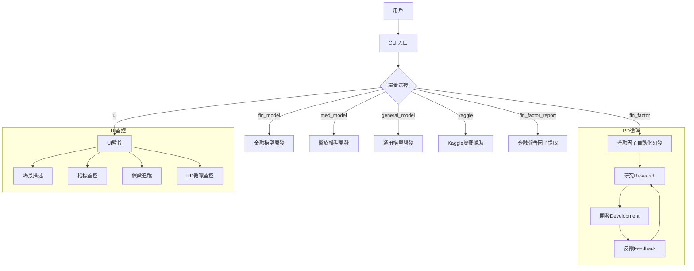

RD-Agent 項目的流程圖。根據代碼分析,主要包含以下幾個核心流程:



主要流程說明:

1. **入口層**:
- 通過 `rdagent` CLI 命令啟動
- 支持多個子命令對應不同場景
- 參考代碼:

```32:44:rdagent/app/cli.py
def ui(port=19899, log_dir="", debug=False):
    """
    start web app to show the log traces.
    """
    with rpath("rdagent.log.ui", "app.py") as app_path:
        cmds = ["streamlit", "run", app_path, f"--server.port={port}"]
        if log_dir or debug:
            cmds.append("--")
        if log_dir:
            cmds.append(f"--log_dir={log_dir}")
        if debug:
            cmds.append("--debug")
        subprocess.run(cmds)
```


2. **場景層**:
- 金融場景: 因子/模型開發
- 醫療場景: 模型開發
- 通用場景: 模型開發
- Kaggle場景: 競賽輔助

3. **RD循環層**:
每個場景都遵循 Research-Development-Feedback 循環:
- Research: 提出假設和想法
- Development: 實現代碼
- Feedback: 獲取反饋並改進
- 參考文檔:

```34:42:README.md
# 🌟 Introduction
<div align="center">
      
</div>

RDAgent aims to automate the most critical and valuable aspects of the industrial R&D process, and we begin with focusing on the data-driven scenarios to streamline the development of models and data. 
Methodologically, we have identified a framework with two key components: 'R' for proposing new ideas and 'D' for implementing them.
We believe that the automatic evolution of R&D will lead to solutions of significant industrial value.

```


4. **UI監控層**:
提供可視化界面監控執行過程:
- 場景描述
- 指標監控
- 假設追蹤
- RD循環監控
- 參考代碼:

```664:673:rdagent/log/ui/app.py
toc = """
## [Scenario Description📖](#_scenario)
## [Summary📊](#_summary)
- [**Metrics📈**](#_metrics)
- [**Hypotheses🏅**](#_hypotheses)
## [RD-Loops♾️](#_rdloops)
- [**Research🔍**](#_research)
- [**Development🛠️**](#_development)
- [**Feedback📝**](#_feedback)
"""
```


5. **配置層**:
- 環境配置(.env)
- 模型配置
- Docker環境
- 參考文檔:

````95:108:README.md
### ⚙️ Configuration
- The demos requires following ability:
  - ChatCompletion
  - json_mode
  - embedding query

- For example: If you are using the `OpenAI API`, you have to configure your GPT model in the `.env` file like this.
  ```bash
  cat << EOF  > .env
  OPENAI_API_KEY=<replace_with_your_openai_api_key>
  # EMBEDDING_MODEL=text-embedding-3-small
  CHAT_MODEL=gpt-4-turbo
  EOF
  ```
````


這個項目採用了模塊化的設計,將不同場景解耦,通過統一的 CLI 介面和 RD 循環框架來實現自動化研發。每個場景都可以獨立運行,並通過 UI 界面進行監控和分析。
